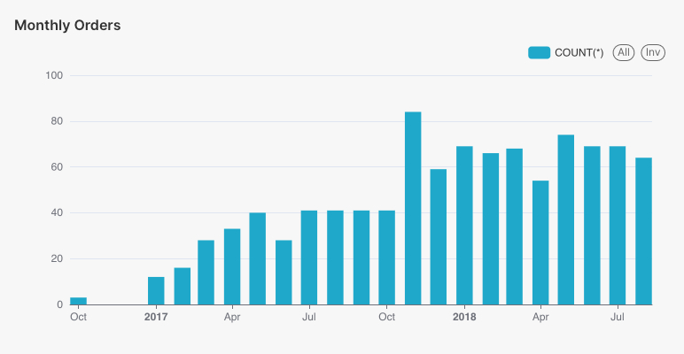
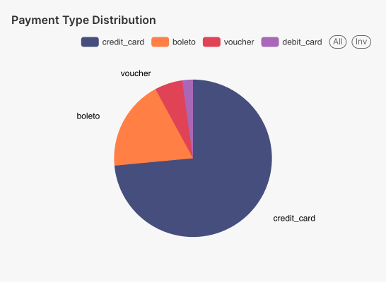
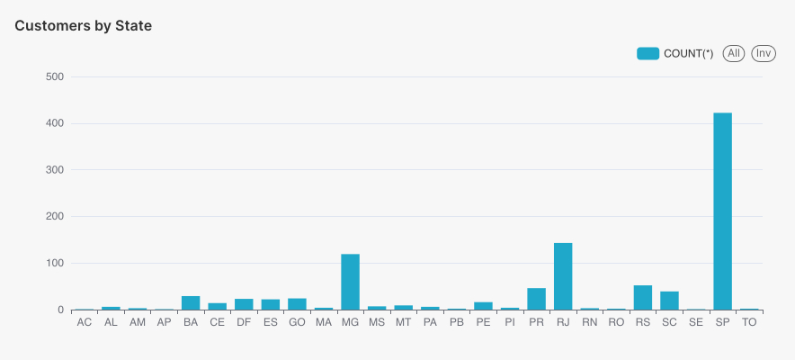
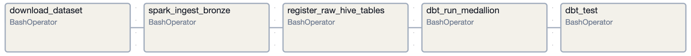

# Big Data Analytics Pipeline — Olist E-Commerce

> End-to-end analytics on Brazil's largest marketplace dataset — from raw CSV to orchestrated Medallion star schema and interactive dashboards.

[](#-phase-1--ingest--visualize)
[](#-phase-2--analytics--star-schema)
[](#-phase-3--orchestration--medallion)

**Dataset:** [Olist Brazilian E-Commerce](https://www.kaggle.com/datasets/olistbr/brazilian-ecommerce) · ~100k orders · 9 CSV tables · 2016–2018

---

## Technologies

| Layer | Stack |
|---|---|
| **Languages** | Python 3 · SQL |
| **Processing** | Apache Spark 3.3 · PySpark · Parquet |
| **Storage** | HDFS · Hive Metastore · ThriftServer |
| **Transform** | dbt-spark · Spark SQL · pandas |
| **Orchestration** | Apache Airflow 2.9 · BashOperator · LocalExecutor |
| **Visualization** | Apache Superset · Hive connector |
| **Infrastructure** | Docker Compose · PostgreSQL |
| **Data source** | Kaggle (kagglehub) |

---

## Overview

The pipeline grows in three phases — each layer builds on the previous one:

| Phase | What we built | Status |
|---|---|:---:|
| **1 — Ingest & Visualize** | CSV → Spark → HDFS Parquet → Superset charts | ✅ |
| **2 — Building Data Pipeline** | Data quality, ELT star schema, 7 business KPIs | ✅ |
| **3 — Re-Construct** | Airflow orchestration + dbt Medallion (Bronze/Silver/Gold) | ✅ |

```
                         ┌──────────────────────────────────────┐
                         │     Phase 3 — Airflow DAG            │
                         │  download → ingest → dbt → test      │
                         └──────────────────┬───────────────────┘
                                            │
[9 CSV files] ──► Spark ──► [HDFS /olist/] ──► dbt Bronze → Silver → Gold
                                    │                    │
                                    ▼                    ▼
                          Hive ThriftServer        Superset dashboards
                                    │                    │
                                    └──── SQL / KPIs ────┘
```

---

## Dataset

| File | ~Rows | Description |
|---|---:|---|
| `olist_orders_dataset.csv` | 100k | Order lifecycle, timestamps, status |
| `olist_order_items_dataset.csv` | 112k | Product, seller, price, freight |
| `olist_order_payments_dataset.csv` | 104k | Payment type, installments, value |
| `olist_order_reviews_dataset.csv` | 100k | Review score (1–5), comments |
| `olist_customers_dataset.csv` | 100k | Customer city, state, zip |
| `olist_sellers_dataset.csv` | 3k | Seller city, state, zip |
| `olist_products_dataset.csv` | 33k | Category, dimensions, weight |
| `olist_geolocation_dataset.csv` | 1M | ZIP code → lat/lng |
| `product_category_name_translation.csv` | 71 | PT → EN category names |

```bash
python scripts/download_dataset.py   # → data/raw/ (gitignored)
```

---

## Screenshots

### Phase 1 — Superset

| Monthly orders | Payment type distribution |
|:---:|:---:|
|  |  |

| Customers by state | Average review score |
|:---:|:---:|
|  |  |

### Phase 3 — Airflow



---

## Quick start

```bash
bash scripts/setup_network.sh

# Phase 1 + 2 (ingest, star schema, KPIs, Superset)
bash scripts/run_pipeline.sh

# Phase 3 (adds Airflow + dbt Medallion)
bash scripts/run_phase3.sh
# → http://localhost:8089 → trigger: olist_medallion_pipeline
```

### Service URLs

| Service | URL | Login |
|---|---|---|
| **Superset** | http://localhost:8088 | admin / admin |
| **Airflow** | http://localhost:8089 | admin / admin |
| Spark Master | http://localhost:8080 | — |
| HDFS NameNode | http://localhost:9870 | — |
| Hive ThriftServer | localhost:10000 | — |

### Superset Hive URIs

| Layer | URI |
|---|---|
| Raw (Phase 1) | `hive://spark-thriftserver:10000/olist` |
| Star (Phase 2) | `hive://spark-thriftserver:10000/olist_star` |
| Gold (Phase 3) | `hive://spark-thriftserver:10000/gold` |

> If the table picker shows wrong names, use **SQL Lab**: `SELECT * FROM olist.orders LIMIT 1000` → Save dataset.

---

## Phase 1 — Ingest & Visualize

**Goal:** Load all CSVs into HDFS as Parquet and build simple Superset charts.

| Component | Path |
|---|---|
| Download | `scripts/download_dataset.py` |
| Spark ingest | `processing/analysis.py` |
| Hive register | `visualization/register_tables.py` |
| One-command run | `scripts/run_pipeline.sh` |

**Charts built**

| Chart | Table | Metric × Dimension |
|---|---|---|
| Monthly orders | `orders` | COUNT(order_id) × month |
| Payment distribution | `order_payments` | SUM/COUNT × payment_type |
| Customers by state | `customers` | COUNT × customer_state |
| Avg review score | `order_reviews` | AVG(review_score) |

<details>
<summary><b>Manual run commands</b></summary>

```bash
docker compose -f docker/docker-compose-hdfs.yml up -d
docker compose -f docker/docker-compose-spark.yml up -d
docker compose -f docker/docker-compose-superset.yml up -d

docker exec -e CSV_DIR=/app/data/raw spark-master /spark/bin/spark-submit \
  --master spark://spark-master:7077 \
  --conf spark.hadoop.fs.defaultFS=hdfs://namenode:9000 \
  /app/processing/analysis.py

python visualization/register_tables.py
```

</details>

---

## Phase 2 — Analytics & Star Schema

**Goal:** Clean data, build a star schema (ELT), answer seven business questions.

📄 Full STUDY → [`reports/REPORT.md`](reports/REPORT.md)

### Data quality & deduplication

| Finding | Action |
|---|---|
| Core PKs unique (orders, items, payments…) | Keep |
| `geolocation` ~261k duplicate rows | `dropDuplicates()` |
| `order_reviews` ~814 dup `review_id` | Dedupe; one review per order |
| Null delivery dates (~3%) | Filter for delivery KPIs |

Report → [`reports/data_quality.md`](reports/data_quality.md) · Script → `processing/data_quality.py`

### ELT approach

1. **Extract / Load** — CSV → Spark → raw Parquet (`processing/analysis.py`)
2. **Transform** — Clean + star schema on HDFS (`processing/build_star_schema.py`)

### Star schema

```
                 dim_date
                    │
   dim_customer ─ fact_sales ─ dim_product
                    │
               dim_seller

   dim_customer ─ fact_orders
   dim_date     ─ fact_payments
   dim_date     ─ fact_reviews
```

| Hive schema | Content |
|---|---|
| `olist` | 9 raw tables |
| `olist_star` | 5 dimensions + 4 facts |

### Business questions

| Question | Fact | Dimension |
|---|---|---|
| Monthly revenue | `fact_sales` | `dim_date` |
| Revenue by category | `fact_sales` | `dim_product` |
| Top sellers | `fact_sales` | `dim_seller` |
| Sales by customer state | `fact_sales` | `dim_customer` |
| Avg delivery time by state | `fact_orders` | `dim_customer` |
| Payment method trends | `fact_payments` | `dim_date` |
| Avg review score by category | `fact_reviews` | `dim_product` |

**Sample results:** total revenue **~15.8M BRL** · top state **SP** · top category **health_beauty**

→ [`business_answers.md`](reports/business_answers.md) · [`sql/business_questions.sql`](sql/business_questions.sql) · `processing/business_questions.py`

<details>
<summary><b>Run Phase 2 transforms</b></summary>

```bash
docker exec spark-master /spark/bin/spark-submit \
  --master spark://spark-master:7077 \
  --conf spark.hadoop.fs.defaultFS=hdfs://namenode:9000 \
  /app/processing/build_star_schema.py

python processing/data_quality.py
python processing/business_questions.py
python visualization/register_tables.py
```

</details>

---

## Phase 3 — Orchestration & Medallion

**Goal:** Automate the pipeline with **Airflow**; rebuild star schema in **dbt** as Bronze → Silver → Gold.

📄 Full STUDY → [`reports/PHASE3.md`](reports/PHASE3.md)

### Airflow DAG — `olist_medallion_pipeline`

```
download_dataset
       ↓
spark_ingest_bronze
       ↓
register_raw_hive_tables
       ↓
dbt_run_medallion
       ↓
dbt_test
```

| Task | Operator | Runs on |
|---|---|---|
| `download_dataset` | BashOperator | Host / mounted volume |
| `spark_ingest_bronze` | BashOperator → `docker exec spark-submit` | Spark cluster |
| `register_raw_hive_tables` | BashOperator → Python | Hive ThriftServer |
| `dbt_run_medallion` | BashOperator → `dbt run` | Thrift SQL |
| `dbt_test` | BashOperator → `dbt test` | Thrift SQL |

Schedule: `@daily` · Retries: 1 · UI: http://localhost:8089

### dbt Medallion layers

| Layer | Schema | Role | Examples |
|---|---|---|---|
| **Bronze** | `bronze` | Raw 1:1 landing | `orders`, `geolocation` |
| **Silver** | `silver` | Clean, typed, deduped | `silver_orders`, `silver_geolocation` |
| **Gold** | `gold` | Star schema for BI | `dim_*`, `fact_sales`, `fact_orders` |

dbt project → `dbt/models/` · DAG → `airflow/dags/olist_medallion_dag.py`

<details>
<summary><b>Run Phase 3 / manual dbt</b></summary>

```bash
bash scripts/run_phase3.sh

# Or run dbt inside Airflow container:
docker exec -e DBT_SPARK_HOST=spark-thriftserver airflow-scheduler \
  bash -c 'cd /opt/airflow/dbt && dbt run --profiles-dir /opt/airflow/dbt && dbt test --profiles-dir /opt/airflow/dbt'
```

</details>

---

## Project structure

```
BigData-Pipeline-Project/
├── airflow/dags/           Phase 3 — Airflow DAG
├── dbt/models/
│   ├── bronze/             Raw 1:1 models
│   ├── silver/             Cleaned / typed
│   └── gold/               Star schema (dim + fact)
├── docker/                 HDFS · Spark · Superset · Airflow
├── processing/
│   ├── analysis.py         Phase 1 ingest
│   ├── build_star_schema.py Phase 2 star (Spark)
│   ├── data_quality.py     Quality report
│   └── business_questions.py  KPI answers
├── scripts/                run_pipeline.sh · run_phase3.sh
├── sql/                    business_questions.sql
├── visualization/          Hive table registration
└── reports/
    ├── REPORT.md           Phase 1 + 2 STUDY
    ├── PHASE3.md           Phase 3 STUDY
    ├── data_quality.md
    ├── business_answers.md
    └── screenshots/        Superset + Airflow captures
```

---

## Reports & deliverables

| Document | What's inside |
|---|---|
| [`reports/REPORT.md`](reports/REPORT.md) | Phase 1 steps + Phase 2 STUDY (clean data, ELT, layers, star schema) |
| [`reports/PHASE3.md`](reports/PHASE3.md) | Airflow components, DAG walk-through, Medallion benefits, challenges |
| [`reports/data_quality.md`](reports/data_quality.md) | Duplicate analysis + dedupe proof |
| [`reports/business_answers.md`](reports/business_answers.md) | 7 business question results |
| [`reports/screenshots/`](reports/screenshots/) | Superset charts + Airflow DAG graph |

---

## Stop services

```bash
docker compose -f docker/docker-compose-airflow.yml down
docker compose -f docker/docker-compose-superset.yml down
docker compose -f docker/docker-compose-spark.yml down
docker compose -f docker/docker-compose-hdfs.yml down
```

---

## Submission

Fork this repository → implement → open a **Pull Request** to the upstream repo. PRs are the only accepted submission method.

Docker Compose files are a reference setup — you may run components however you prefer as long as the pipeline works end-to-end.

---

*Big Data Analytics Pipeline — Olist E-Commerce · Phases 1–3*
